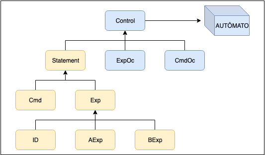

# P1 Compiladores

Em cada tópico a seguir explicaremos como implementamos o funcionamento do π framework em Ocaml.

## Gramática π

Usamos os tipos indutivos de Ocaml para criar uma estrutura de tipos iguais às definidas pelo framework. O tipo _statement_ é o usado para definir o nível máximo no qual o lexer e o parser trabalham. O _statement_ está dentro do tipo _control_ que é onde o autômato trabalha, pois além das denotações ele faz uso dos Opcodes, que por sua vez estão definidos como tipos induzidos pelo tipo _control_ conforme a estrutura simplificada abaixo. 
<p align="center">

</p>

A gramática do nível das expressões é definida como 

```
<Statement> ::= <Exp> 

<Exp>       ::= <ArithExp> | <BoolExp> 

<ArithExp>  ::= Num(<digits>) | Sum(<Exp> , <Exp> ) | Sub(<Exp>, <Exp>) | 
                Mul(<Exp>, <Exp>) | Div(<Exp>, <Exp>)

<BoolExp>   ::= Boo(<bool>) | Eq(<Exp>, <Exp>) | Lt(<Exp>, <Exp>) | 
                Le(<Exp>, <Exp>) | Gt(<Exp>, <Exp>) | Ge(<Exp>, <Exp>) | 
                And(<Exp>, <Exp>) | Or(<Exp>, <Exp>) | Not(<Exp>) 

<bool>      ::= True | False
```

e foi implementada em Ocaml da seguinte maneira

```
type statement = 
   | Exp of expression
;;

type arithmeticExpression = 
  | Num of int
  | Sum of expression * expression
  | Sub of expression * expression
  | Mul of expression * expression
  | Div of expression * expression 
;;

type booleanExpression =
  | Boo of bool  
  | Eq of expression * expression
  | Lt of expression * expression
  | Le of expression * expression
  | Gt of expression * expression
  | Ge of expression * expression
  | And of expression * expression
  | Or of expression * expression
  | Not of expression
;;

type expression = 
  | AExp of arithmeticExpression
  | BExp of booleanExpression
  | Id of string
;;
```

Já no nível dos comandos temos a seguinte especificação

```
<Statement> ::= <Cmd> 

<Cmd>       ::= Id(<String>) | Nop | Assign(<Id>, <Exp>) | Loop(<BoolExp>, <Cmd>) | 
                CSeq(<Cmd>, <Cmd>) | Cond(<BoolExp>, <Cmd>, <Cmd>)
```

que foi implementada extendendo esses tipos aos tipos previamente definidos

```
type command = 
  | Loop of expression * command
  | CSeq of command * command
  | Nop
  | Assign of expression * expression
  | Cond of expression * command * command
;;

type statement = 
  | Cmd of command
;;

```
A nível das declarações temos a seguinte especificação
```
<Statement> ::= <Dec> 

<Exp>       ::= Ref(<Exp>)> | DeRef(<Id>) | ValRef(<Id>)

<Dec>       ::= Bind(<Id>, <Exp>) | DSeq(<Dec>, <Dec>)

<Cmd>       ::= Blk(<Dec>, <Cmd>) 
```
que foi implementada extendo os tipos definidos para comando
```
type expression = 
  | AExp of arithmeticExpression
  | BExp of booleanExpression
  | Id of string
  | Ref of expression
  | DeRef of expression
  | ValRef of expression
;;

type command = 
  | Loop of expression * command
  | CSeq of command * command
  | Nop
  | Assign of expression * expression
  | Cond of expression * command * command
  | Blk of declaration * command
;;

type declaration = 
  | DSeq of declaration * declaration
  | Bind of expression * expression
;;

type statement = 
  | Exp of expression
  | Cmd of command
  | Dec of declaration
;;
```

Os opcodes definidos pelas expressões, comandos e declaraçes

```
<ExpOC>     ::= #SUM | #SUB | #MUL | #DIV |   
                #EQ | #LT | #LE | #GT | #GE | #AND | #OR | #NOT

<CmdOC>     ::= #ASSIGN | #LOOP | #COND

<DecOC>     ::= #REF | #BLKDEC | #BLKCMD | #BIND 
```
Foram implementados no nível de controle, que possui também o tipo _statement_ dentro dele

```
type expOc =
  | OPSUM
  | OPMUL
  | OPSUB 
  | OPDIV 
  | OPEQ 
  | OPLT 
  | OPLE 
  | OPGT 
  | OPGE 
  | OPAND 
  | OPOR 
  | OPNOT
;;

type decOC =
   | OPREF
   | OPBLKDEC
   | OPBLKCMD
   | OPBIND
;;

type cmdOc =
  | OPASSIGN 
  | OPLOOP 
  | OPCOND
;;

type control = 
  | Statement of statement
  | ExpOc of expOc
  | CmdOc of cmdOc
  | DecOc of decOC
 ;;
```

## Lexer

De acordo com as especificações da linguagem, criamos tokens para cada estrutura definida pela lingugagem no processo de análise sintática.
Usamos a implementação em Ocaml do programa lex, o Ocamllex, definido em um arquivo .mll. Com ele definimos uma expressão regular para cada token que queremos identificar. O retorno da função do lexer é uma lista dos tokens que definimos. A declaração de cada token fica no arquivo que define as estruturas do parser, explicado logo a seguir, no arquivo do lexer importamos o parser para termos acesso a esses tokens. 

Vamos ilustrar o processo do lexer com um exemplo. Dado o código fonte imp 

```
x := x + 1
```

Vemos a definição dos tokens que serão usados nesse caso

```
  %token <int> NUMBER
  %token <string> ID
  %token PLUS 
  %token ASSIGN
```

E também as expressões regulares que identificam e retornam cada um desses tokens

```
rule token = parse
    [' ' '\t' '\r' '\n'  ]   { token lexbuf }     (* skip blanks *)
  | (['-']? ['0'-'9']+) as  lxm      { NUMBER( int_of_string lxm) }
  | '+'                     { PLUS }
  | ":="                    { ASSIGN }
  | (['a'-'z' 'A'-'Z' '_'] ['a'-'z' 'A'-'Z' '0'-'9' '_']*) as  lxm      { ID(lxm) }
  | eof                     { EOF }
```

No nosso exemplo então a lista de tokens referente ao código de entrada em imp é

```
ID(x) ASSIGN ID(x) SUM NUMBER(1)
```


## Parser

O parser, Ocamlyacc é a implementação de Ocaml do programa yacc, definido em um arquivo mly. Ele é um Parser Generator de propósito geral que converte uma descricão de uma gramática para uma LALR(1) (Look Ahead Left to Right) em um programa Ocaml para realizar o parser da gramática.Com isso ele deve analisar a estrutura do programa sendo o nosso analisador semântico. Para implementarmos o π framework, de acordo com a leitura de tokens específicas feita, retornamos a denotação π associada àquela operação. O programa é uma tabela de tokens estruturados similares às expressões regulares definidas no lexer. O parser recebe a lista de tokens associada ao programa de entrada e analisa qual estrutura definida em sua tabela corresponde à primeira correspondência lida nessa lista. 

A forma geral de um arquivo de gramática em Ocamlyacc é a seguinte:
```
%{
Header(Ocaml code)
%}

Ocamlyacc declarations

%%

Grammar rules

%%

Trailer(Additional Ocaml code)
```
O %%,% {e%} são sinais de pontuação que aparecem em todos os arquivos gramaticais do Ocamlyacc para separar as seções.O cabeçalho(Header) pode definir os tipos, variáveis e funções usadas nas ações. As declarações de Ocamlyacc(Ocamlyacc declarations) definem o nome dos símbolos terminais e não-terminais e também podem descrever a precedência e os tipos de dados dos valores semânticos de vários símbolos. As regras ( Grammar rules) definem como construir cada símbolo não terminal a partir de suas partes. O Trailer é opcional e contém qualquer código Ocaml que você deseja usar.

A tabela definida no arquivo do parser tem algumas restrições. Primeiro ela deve retornar um tipo único, no nosso caso a π denotação que englobe todas as outras, _statement_. Definimos todos os tipos definidos da gramática também no parser para a melhor estruturação da leitura dos tokens. 

Temos então a definição dos tipos das π denotações no nível do parser

```
%type <Pi.statement> main
%type <Pi.statement> statement
%type <Pi.expression> expression
%type <Pi.declaration> declaration
%type <Pi.arithmeticExpression> arithmeticExpression
%type <Pi.booleanExpression> booleanExpression
%type <Pi.command> command
%type <Pi.expression> bindableVariable
%type <Pi.expression> variable
```

Onde criamos o tipo main como tipo de retorno da função

```
%%
main:
    statement EOF     { $1 }
;
```

Para cada tipo definido então definimos a estrutura de tokens associado a ele que está de acordo com as especificações da linguagem. Cada tipo pode retornar outros tipos, ou diretamente uma π denotação, o parser funciona como um todo então através da recursão. Os tipos mantém a mesma hierarquia do π framework e da linguagem.

```
statement:
  expression     { Pi.Exp($1)}
  | command      { Pi.Cmd($1)}
;
declaration:
  | VAR ID BIND expression              { Pi.Bind(Pi.Id($2), Pi.Ref($4)) }
  | CNS ID BIND bindableVariable        { Pi.Bind(Pi.Id($2), $4) }
  | declaration COMMA declaration       { Pi.DSeq($1, $3) }
  | LPAREN declaration RPAREN           { $2 }
;
command:
  LOOP expression DO command  END                { Pi.Loop(($2), $4)}
  | IF expression THEN command ELSE command END  { Pi.Cond(($2), $4, $6)}
  | IF expression THEN command END               { Pi.Cond(($2), $4, Pi.Nop)}
  | ID ASSIGN expression                         { Pi.Assign(Pi.Id($1), $3) }
  | command  command                             { Pi.CSeq($1, $2) }
  | LET declaration IN command                   { Pi.Blk($2, $4)}
  | LET declaration IN command END               { Pi.Blk($2, $4)}
  | LPAREN command RPAREN                        { $2 }
;
expression: 
    ADDRESS ID                                   { Pi.DeRef(Pi.Id($2))}
    | bindableVariable                           { $1 }
    | LPAREN expression RPAREN                   { $2 }

;
 bindableVariable: 
     arithmeticExpression                        { Pi.AExp( $1) }
    | booleanExpression                          { Pi.BExp( $1) }
    | variable                                   { $1 }
    | LPAREN bindableVariable RPAREN             { $2 }

;
variable:
   ID                                            { Pi.Id( $1) }
  | TIMESORPOINTER ID                            { Pi.ValRef(Pi.Id($2))}
  | LPAREN variable RPAREN                       { $2 }
;
arithmeticExpression:  
  NUMBER                                                     { Pi.Num($1) }
  | arithmeticExpression PLUS arithmeticExpression           { Pi.Sum(Pi.AExp($1), Pi.AExp($3) )  }
  | arithmeticExpression PLUS variable                       { Pi.Sum(Pi.AExp($1), $3 )  }
  | variable PLUS arithmeticExpression                       { Pi.Sum($1, Pi.AExp($3) )  }
  | variable PLUS variable                                   { Pi.Sum($1, $3 )  }
  ...
```

De acordo com a estruturação feita, ao lermos o token NUMBER, iremos cair no caso em que retornamos a denotação Num, que por sua vez, graças a recursão de tipos é englobada dentro do tipo arithmeticExpression, que engloba a denotação Num na denotação AExp, até chegarmos no tipo definido pela main. 

Com o exemplo mostrado podemos fazer o parse da lista de tokens mostrada no último tópico que será

```
Assign(Id(x), Sum(Id(x), Num(1)))
```


## Autômato π 

No autômato, o nosso código inicia-se com um POP na pilha de controle, e logo em seguida faz-se o seguinte pattern matching, para tomar a devida decisão de acordo com o elemento que se retirou, podendo ele ser algum tipo indutivo de π ou algum opcode. Dessa forma, o autômato opera recebendo um estado válido(q) e faz uma transição para o estado (q') através da função de transição δ  - δ(q) -> δ(q') - conforme o exemplo a seguir.


Quando lê-se o Num(N), simplesmente colocamos o valor N na pilha de valores.


```
δ(Num(N) :: C, V, S) = δ(C, N :: V, S) 
```

```
Num(x) -> 
(
  (Stack.push (Int(x)) valueStack);
);
```

Quando lê-se o Sum(E1, E2), devemos antes verificar a qual tipo pertencem os dois parâmetros de _expression_ (Arithmetic Expression ou Id(x)) podendo haver a combinação 2 a 2 deles. Por exemplo, podemos fazer os 4 tipos de soma: 2 + 2; 2 + x; x + 2; x + y;

Para cada um desses casos, agimos da mesma forma: colocamos primeiro o opcode #SUM, depois o E2 e por fim o E1 na pilha de controle.


```
δ(Sum(E₁, E₂) :: C, V, S) = δ(E₁ :: E₂ :: #SUM :: C, V, S) 
```

```
| Sum(AExp(x), AExp(y)) -> (
  (Stack.push (ExpOc(OPSUM)) controlStack);
  (Stack.push (Statement(Exp(AExp(y)))) controlStack);
  (Stack.push (Statement(Exp(AExp(x)))) controlStack);
);
| Sum(Id(x), AExp(y)) -> (
  (Stack.push (ExpOc(OPSUM)) controlStack);
  (Stack.push (Statement(Exp(AExp(y)))) controlStack);
  (Stack.push (Statement(Exp(Id(x)))) controlStack);
); 
| Sum(AExp(x), Id(y)) ->  (
  (Stack.push (ExpOc(OPSUM)) controlStack);
  (Stack.push (Statement(Exp(Id(y)))) controlStack);
  (Stack.push (Statement(Exp(AExp(x)))) controlStack);
); 
| Sum(Id(x), Id(y)) ->  (
  (Stack.push (ExpOc(OPSUM)) controlStack);
  (Stack.push (Statement(Exp(Id(y)))) controlStack);
  (Stack.push (Statement(Exp(Id(x)))) controlStack);
);
| Sum( ValRef(Id(x)), ValRef(Id(y)) ) ->  (
  (Stack.push (ExpOc(OPSUM)) controlStack);
  (Stack.push (Statement(Exp(ValRef(Id(y))))) controlStack);
  (Stack.push (Statement(Exp(ValRef(Id(x))))) controlStack);
);
| Sum(ValRef(Id(x)), AExp(y)) ->  (
  (Stack.push (ExpOc(OPSUM)) controlStack);
  (Stack.push (Statement(Exp(AExp(y)))) controlStack);
  (Stack.push (Statement(Exp(ValRef(Id(x))))) controlStack);
);
| Sum( AExp(x), ValRef(Id(y)) ) ->  (
  (Stack.push (ExpOc(OPSUM)) controlStack);
  (Stack.push (Statement(Exp(ValRef(Id(y))))) controlStack);
  (Stack.push (Statement(Exp(AExp(x)))) controlStack);
);
| Sum(ValRef(Id(x)), Id(y)) ->  (
  (Stack.push (ExpOc(OPSUM)) controlStack);
  (Stack.push (Statement(Exp(Id(y)))) controlStack);
  (Stack.push (Statement(Exp(ValRef(Id(x))))) controlStack);
);
| Sum( Id(x), ValRef(Id(y)) ) ->  (
  (Stack.push (ExpOc(OPSUM)) controlStack);
  (Stack.push (Statement(Exp(ValRef(Id(y))))) controlStack);
  (Stack.push (Statement(Exp(Id(x)))) controlStack);
);
| Sum(_, _) -> raise (AutomatonException "Error on Sum - |aexp"); 
```

Ao ler o #SUM, fazemos um pop na pilha de valores para ler o valor Num(N1) e verificamos que é do tipo inteiro. Depois fazemos outro POP para ler o valor Num(N2) e verificamos que este também é do tipo inteiro. Depois somamos eles, colocando o resultado na pilha de valores. Caso não sejam, cairíamos em uma Exception.

```
δ(#SUM :: C, Num(N₁) :: Num(N₂) :: V, S) = δ(C, N₁ + N₂ :: V, S)
```

```
OPSUM -> 
(
  let x = (Stack.pop valueStack) in
    match x with
      | Int(i) -> (
        let y = (Stack.pop valueStack) in
        match y with
          | Int(j) -> (
            (Stack.push (Int(i + j)) valueStack);
            
          );
          | _ -> raise (AutomatonException "Error on #SUM");
      );
      | _ -> raise (AutomatonException "Error on #SUM");
);
```

Quando lê-se o Sub(E1, E2), devemos antes verificar a qual tipo pertencem os dois parâmetros de _expression_ (Arithmetic Expression ou Id(x)) podendo haver a combinação 2 a 2 deles. Por exemplo, podemos fazer os 4 tipos de subtração: 4 - 4; 4 - x; x - 4; x - y;

Para cada um desses casos, agimos da mesma forma: colocamos primeiro o opcode #SUB, depois o E2 e por fim o E1 na pilha de controle.

```
δ(Sub(E₁, E₂) :: C, V, S) = δ(E₁ :: E₂ :: #SUB :: C, V, S)  
```

```
| Sub(AExp(x), AExp(y)) -> (
  (Stack.push (ExpOc(OPSUB)) controlStack);
  (Stack.push (Statement(Exp(AExp(y)))) controlStack);
  (Stack.push (Statement(Exp(AExp(x)))) controlStack);
);
| Sub(Id(x), AExp(y)) -> (
  (Stack.push (ExpOc(OPSUB)) controlStack);
  (Stack.push (Statement(Exp(AExp(y)))) controlStack);
  (Stack.push (Statement(Exp(Id(x)))) controlStack);
); 
| Sub(AExp(x), Id(y)) ->  (
  (Stack.push (ExpOc(OPSUB)) controlStack);
  (Stack.push (Statement(Exp(Id(y)))) controlStack);
  (Stack.push (Statement(Exp(AExp(x)))) controlStack);
); 
| Sub(Id(x), Id(y)) ->  (
  (Stack.push (ExpOc(OPSUB)) controlStack);
  (Stack.push (Statement(Exp(Id(y)))) controlStack);
  (Stack.push (Statement(Exp(Id(x)))) controlStack);
);
| Sub( ValRef(Id(x)), ValRef(Id(y)) ) ->  (
  (Stack.push (ExpOc(OPSUB)) controlStack);
  (Stack.push (Statement(Exp(ValRef(Id(y))))) controlStack);
  (Stack.push (Statement(Exp(ValRef(Id(x))))) controlStack);
);
| Sub(ValRef(Id(x)), AExp(y)) ->  (
  (Stack.push (ExpOc(OPSUB)) controlStack);
  (Stack.push (Statement(Exp(AExp(y)))) controlStack);
  (Stack.push (Statement(Exp(ValRef(Id(x))))) controlStack);
);
| Sub( AExp(x), ValRef(Id(y)) ) ->  (
  (Stack.push (ExpOc(OPSUB)) controlStack);
  (Stack.push (Statement(Exp(ValRef(Id(y))))) controlStack);
  (Stack.push (Statement(Exp(AExp(x)))) controlStack);
);
| Sub(ValRef(Id(x)), Id(y)) ->  (
  (Stack.push (ExpOc(OPSUB)) controlStack);
  (Stack.push (Statement(Exp(Id(y)))) controlStack);
  (Stack.push (Statement(Exp(ValRef(Id(x))))) controlStack);
);
| Sub( Id(x), ValRef(Id(y)) ) ->  (
  (Stack.push (ExpOc(OPSUB)) controlStack);
  (Stack.push (Statement(Exp(ValRef(Id(y))))) controlStack);
  (Stack.push (Statement(Exp(Id(x)))) controlStack);
); 
| Sub(_, _) -> raise (AutomatonException "Error on Sub");
```

Ao ler o #SUB, fazemos um pop na pilha de valores para ler o valor Num(N1) e verificamos que é do tipo inteiro. Depois fazemos outro POP para ler o valor Num(N2) e verificamos que este também é do tipo inteiro. Depois subtraímos eles, colocando o resultado na pilha de valores. Caso não sejam, cairíamos em uma Exception.

```
δ(#SUB :: C, Num(N₁) :: Num(N₂) :: V, S) = δ(C, N₁ - N₂ :: V, S)
```

```            
OPSUB -> 
(
  let x = (Stack.pop valueStack) in
    match x with
      | Int(i) -> (
        let y = (Stack.pop valueStack) in
        match y with
          | Int(j) -> (
            (Stack.push (Int(j - i)) valueStack);
            
          );
          | _ -> raise (AutomatonException "Error on #SUB");
      );
      | _ -> raise (AutomatonException "Error on #SUB");
);
```            


Quando lê-se o Mul(E1, E2), devemos antes verificar a qual tipo pertencem os dois parâmetros de _expression_ (Arithmetic Expression ou Id(x)) podendo haver a combinação 2 a 2 deles. Por exemplo, podemos fazer os 4 tipos de multiplicação: 5 * 4; 5 * x; x * 5; x * y;

Para cada um desses casos, agimos da mesma forma: colocamos primeiro o opcode #MUL, depois o E2 e por fim o E1 na pilha de controle.


```
δ(Mul(E₁, E₂) :: C, V, S) = δ(E₁ :: E₂ :: #MUL :: C, V, S) 
```

```            
| Mul(AExp(x), AExp(y)) -> (
  (Stack.push (ExpOc(OPMUL)) controlStack);
  (Stack.push (Statement(Exp(AExp(y)))) controlStack);
  (Stack.push (Statement(Exp(AExp(x)))) controlStack);
);
| Mul(Id(x), AExp(y)) -> (
  (Stack.push (ExpOc(OPMUL)) controlStack);
  (Stack.push (Statement(Exp(AExp(y)))) controlStack);
  (Stack.push (Statement(Exp(Id(x)))) controlStack);
); 
| Mul(AExp(x), Id(y)) ->  (
  (Stack.push (ExpOc(OPMUL)) controlStack);
  (Stack.push (Statement(Exp(Id(y)))) controlStack);
  (Stack.push (Statement(Exp(AExp(x)))) controlStack);
); 
| Mul(Id(x), Id(y)) ->  (
  (Stack.push (ExpOc(OPMUL)) controlStack);
  (Stack.push (Statement(Exp(Id(y)))) controlStack);
  (Stack.push (Statement(Exp(Id(x)))) controlStack);
);
| Mul( ValRef(Id(x)), ValRef(Id(y)) ) ->  (
  (Stack.push (ExpOc(OPMUL)) controlStack);
  (Stack.push (Statement(Exp(ValRef(Id(y))))) controlStack);
  (Stack.push (Statement(Exp(ValRef(Id(x))))) controlStack);
);
| Mul(ValRef(Id(x)), AExp(y)) ->  (
  (Stack.push (ExpOc(OPMUL)) controlStack);
  (Stack.push (Statement(Exp(AExp(y)))) controlStack);
  (Stack.push (Statement(Exp(ValRef(Id(x))))) controlStack);
);
| Mul( AExp(x), ValRef(Id(y)) ) ->  (
  (Stack.push (ExpOc(OPMUL)) controlStack);
  (Stack.push (Statement(Exp(ValRef(Id(y))))) controlStack);
  (Stack.push (Statement(Exp(AExp(x)))) controlStack);
);
| Mul(ValRef(Id(x)), Id(y)) ->  (
  (Stack.push (ExpOc(OPMUL)) controlStack);
  (Stack.push (Statement(Exp(Id(y)))) controlStack);
  (Stack.push (Statement(Exp(ValRef(Id(x))))) controlStack);
);
| Mul( Id(x), ValRef(Id(y)) ) ->  (
  (Stack.push (ExpOc(OPMUL)) controlStack);
  (Stack.push (Statement(Exp(ValRef(Id(y))))) controlStack);
  (Stack.push (Statement(Exp(Id(x)))) controlStack);
); 
| Mul(_, _) -> raise (AutomatonException "Error on Mul");
```

Ao ler o #MUL, fazemos um pop na pilha de valores para ler o valor Num(N1) e verificamos que é do tipo inteiro. Depois fazemos outro POP para ler o valor Num(N2) e verificamos que este também é do tipo inteiro. Depois multiplicamos eles, colocando o resultado na pilha de valores. Caso não sejam, cairíamos em uma Exception.

```
δ(#MUL :: C, Num(N₁) :: Num(N₂) :: V, S) = δ(C, N₁ * N₂ :: V, S)
```

```
OPMUL -> 
(
  let x = (Stack.pop valueStack) in
    match x with
      | Int(i) -> (
        let y = (Stack.pop valueStack) in
        match y with
          | Int(j) -> (
            (Stack.push (Int(i * j)) valueStack);
            
          );
          | _ -> raise (AutomatonException "Error on #MUL");
      );
      | _ -> raise (AutomatonException "Error on #MUL");
);
```

Quando lê-se o Div(E1, E2), devemos antes verificar a qual tipo pertencem os dois parâmetros de _expression_ (Arithmetic Expression ou Id(x)) podendo haver a combinação 2 a 2 deles. Por exemplo, podemos fazer os 4 tipos de divisão: 6 / 2; 6 / x; x / 6; x / y;

Para cada um desses casos, agimos da mesma forma: colocamos primeiro o opcode #DIV, depois o E2 e por fim o E1 na pilha de controle.


```
δ(Div(E₁, E₂) :: C, V, S) = δ(E₁ :: E₂ :: #DIV :: C, V, S)  
```

```              
| Div(AExp(x), AExp(y)) -> (
  (Stack.push (ExpOc(OPDIV)) controlStack);
  (Stack.push (Statement(Exp(AExp(y)))) controlStack);
  (Stack.push (Statement(Exp(AExp(x)))) controlStack);
);
| Div(Id(x), AExp(y)) -> (
  (Stack.push (ExpOc(OPDIV)) controlStack);
  (Stack.push (Statement(Exp(AExp(y)))) controlStack);
  (Stack.push (Statement(Exp(Id(x)))) controlStack);
); 
| Div(AExp(x), Id(y)) ->  (
  (Stack.push (ExpOc(OPDIV)) controlStack);
  (Stack.push (Statement(Exp(Id(y)))) controlStack);
  (Stack.push (Statement(Exp(AExp(x)))) controlStack);
); 
| Div(Id(x), Id(y)) ->  (
  (Stack.push (ExpOc(OPDIV)) controlStack);
  (Stack.push (Statement(Exp(Id(y)))) controlStack);
  (Stack.push (Statement(Exp(Id(x)))) controlStack);
);
| Div( ValRef(Id(x)), ValRef(Id(y)) ) ->  (
  (Stack.push (ExpOc(OPDIV)) controlStack);
  (Stack.push (Statement(Exp(ValRef(Id(y))))) controlStack);
  (Stack.push (Statement(Exp(ValRef(Id(x))))) controlStack);
);
| Div(ValRef(Id(x)), AExp(y)) ->  (
  (Stack.push (ExpOc(OPDIV)) controlStack);
  (Stack.push (Statement(Exp(AExp(y)))) controlStack);
  (Stack.push (Statement(Exp(ValRef(Id(x))))) controlStack);
);
| Div( AExp(x), ValRef(Id(y)) ) ->  (
  (Stack.push (ExpOc(OPDIV)) controlStack);
  (Stack.push (Statement(Exp(ValRef(Id(y))))) controlStack);
  (Stack.push (Statement(Exp(AExp(x)))) controlStack);
);
| Div(ValRef(Id(x)), Id(y)) ->  (
  (Stack.push (ExpOc(OPDIV)) controlStack);
  (Stack.push (Statement(Exp(Id(y)))) controlStack);
  (Stack.push (Statement(Exp(ValRef(Id(x))))) controlStack);
);
| Div( Id(x), ValRef(Id(y)) ) ->  (
  (Stack.push (ExpOc(OPDIV)) controlStack);
  (Stack.push (Statement(Exp(ValRef(Id(y))))) controlStack);
  (Stack.push (Statement(Exp(Id(x)))) controlStack);
); 
| Div(_, _) -> raise (AutomatonException "Error on Div"); 
```

Ao ler o #DIV, fazemos um pop na pilha de valores para ler o valor Num(N1) e verificamos que é do tipo inteiro e diferente de zero, pois não se pode dividir um número por zero. Depois fazemos outro POP para ler o valor Num(N2) e verificamos que este também é do tipo inteiro. Depois dividimos Y por X, colocando o resultado na pilha de valores. Caso não sejam, cairíamos em uma Exception.


```
δ(#DIV :: C, Num(N₁) :: Num(N₂) :: V, S) = δ(C, N₁ / N₂ :: V, S) if N₂ ≠ 0
```

```
OPDIV -> 
(
  let x = (Stack.pop valueStack) in
    match x with
      | Int(i) -> (
        if (i == 0) then  
          raise (AutomatonException "Error on #DIV. Division by 0") 
        else
          let y = (Stack.pop valueStack) in
        match y with
          | Int(j) -> (
            (Stack.push (Int(j / i)) valueStack);
            
          )
          | _ -> raise (AutomatonException "Error on #DIV");
      );
      | _ -> raise (AutomatonException "Error on #DIV");
);
```


Quando lê-se o Eq(E1, E2), devemos antes verificar a qual tipo pertencem os dois parâmetros de _expression_ (Arithmetic Expression, Boolean Expression ou Id(x)) podendo haver algumas combinações entre eles. Por exemplo, podemos fazer os 7 tipos de igualdade: true == false; true == x; y = false; x == y; 2 == 2; 2 == x; x == 2;

Para cada um desses casos, agimos da mesma forma: colocamos primeiro o opcode #EQ, depois o E2 e por fim o E1 na pilha de controle.


```
δ(Eq(E₁, E₂) :: C, V, S) = δ(E₁ :: E₂ :: #EQ :: C, V, S)
```

```
| Eq(BExp(x), BExp(y)) -> (
  (Stack.push (ExpOc(OPEQ)) controlStack);
  (Stack.push (Statement(Exp(BExp(y)))) controlStack);
  (Stack.push (Statement(Exp(BExp(x)))) controlStack);
);
| Eq(BExp(x), Id(y)) -> (
  (Stack.push (ExpOc(OPEQ)) controlStack);
  (Stack.push (Statement(Exp(Id(y)))) controlStack);
  (Stack.push (Statement(Exp(BExp(x)))) controlStack);
);
| Eq(Id(x), BExp(y)) -> (
  (Stack.push (ExpOc(OPEQ)) controlStack);
  (Stack.push (Statement(Exp(BExp(y)))) controlStack);
  (Stack.push (Statement(Exp(Id(x)))) controlStack);
);
| Eq(Id(x), Id(y)) -> (
  (Stack.push (ExpOc(OPEQ)) controlStack);
  (Stack.push (Statement(Exp(Id(y)))) controlStack);
  (Stack.push (Statement(Exp(Id(x)))) controlStack);
);
| Eq(AExp(x), AExp(y)) -> (
  (Stack.push (ExpOc(OPEQ)) controlStack);
  (Stack.push (Statement(Exp(AExp(y)))) controlStack);
  (Stack.push (Statement(Exp(AExp(x)))) controlStack);
);
| Eq(AExp(x), Id(y)) -> (
  (Stack.push (ExpOc(OPEQ)) controlStack);
  (Stack.push (Statement(Exp(Id(y)))) controlStack);
  (Stack.push (Statement(Exp(AExp(x)))) controlStack);
);
| Eq(Id(x), AExp(y)) -> (
  (Stack.push (ExpOc(OPEQ)) controlStack);
  (Stack.push (Statement(Exp(AExp(y)))) controlStack);
  (Stack.push (Statement(Exp(Id(x)))) controlStack);
);
| Eq(BExp(x), ValRef(Id(y)) )  -> (
  (Stack.push (ExpOc(OPEQ)) controlStack);
  (Stack.push (Statement(Exp(ValRef(Id(y))))) controlStack);
  (Stack.push (Statement(Exp(BExp(x)))) controlStack);
);
| Eq( ValRef(Id(x)), BExp(y)) -> (
  (Stack.push (ExpOc(OPEQ)) controlStack);
  (Stack.push (Statement(Exp(BExp(y)))) controlStack);
  (Stack.push (Statement(Exp(ValRef(Id(x))))) controlStack);
);
| Eq(ValRef(Id(x)), ValRef(Id(y))) -> (
  (Stack.push (ExpOc(OPEQ)) controlStack);
  (Stack.push (Statement(Exp(ValRef(Id(y))))) controlStack);
  (Stack.push (Statement(Exp(ValRef(Id(x))))) controlStack);
);
| Eq(AExp(x), ValRef(Id(y))) -> (
  (Stack.push (ExpOc(OPEQ)) controlStack);
  (Stack.push (Statement(Exp(ValRef(Id(y))))) controlStack);
  (Stack.push (Statement(Exp(AExp(x)))) controlStack);
);
| Eq(ValRef(Id(x)), AExp(y)) -> (
  (Stack.push (ExpOc(OPEQ)) controlStack);
  (Stack.push (Statement(Exp(AExp(y)))) controlStack);
  (Stack.push (Statement(Exp(ValRef(Id(x))))) controlStack);
);
| Eq(Id(x), ValRef(Id(y))) -> (
  (Stack.push (ExpOc(OPEQ)) controlStack);
  (Stack.push (Statement(Exp(ValRef(Id(y))))) controlStack);
  (Stack.push (Statement(Exp(Id(x)))) controlStack);
);
| Eq(ValRef(Id(x)), Id(y)) -> (
  (Stack.push (ExpOc(OPEQ)) controlStack);
  (Stack.push (Statement(Exp(Id(y)))) controlStack);
  (Stack.push (Statement(Exp(ValRef(Id(x))))) controlStack);
);
| Eq(_, _) -> raise (AutomatonException "Error on Eq"); 
```

Ao ler o #EQ, fazemos um pop na pilha de valores para ler o valor E1 e verificamos se ele é do tipo booleano ou inteiro. Depois fazemos outro POP para ler o valor E2 e verificamos se este também é do tipo booleano ou inteiro. Sendo que só se permitem dois POPs consecutivos de valores iguais (dois Bool ou dois Int). Depois verificamos se os valores contidos são iguais, retornando True ou diferentes, retornando False.


```
δ(#EQ :: C, Boo(B₁) :: Boo(B₂) :: V, S) = δ(C, B₁ = B₂ :: V, S)
```

```
OPEQ -> 
(
  let x = (Stack.pop valueStack) in
    match x with
      | Bool(i) -> (
        let y = (Stack.pop valueStack) in
        match y with
          | Bool(j) -> (
            (Stack.push (Bool(i == j)) valueStack);
            
          );
          | _ -> raise (AutomatonException "Error on #EQ");
      );
      | Int(i) -> (
        let y = (Stack.pop valueStack) in
        match y with
          | Int(j) -> (
            (Stack.push ( Bool ( i == j)) valueStack);
            
          );
          | _ -> raise (AutomatonException "Error on #EQ");
      );
      | _ -> raise (AutomatonException "Error on #EQ");
);
```

Quando lê-se o Lt(E1, E2), devemos antes verificar a qual tipo pertencem os dois parâmetros de _expression_ (Arithmetic Expression ou Id(x)) podendo haver uma combinação 2 a 2 entre eles. Por exemplo, podemos fazer os 4 tipos de desigualdades: 2 < 5; 3 < x; x < 4; x < y; 

Para cada um desses casos, agimos da mesma forma: colocamos primeiro o opcode #LT, depois o E2 e por fim o E1 na pilha de controle.


```
δ(Lt(E₁, E₂) :: C, V, S) = δ(E₁ :: E₂ :: #LT :: C, V, S)
```

```
| Lt(AExp(x), AExp(y)) -> (
  (Stack.push (ExpOc(OPLT)) controlStack);
  (Stack.push (Statement(Exp(AExp(y)))) controlStack);
  (Stack.push (Statement(Exp(AExp(x)))) controlStack);
);
| Lt(AExp(x), Id(y)) -> (
  (Stack.push (ExpOc(OPLT)) controlStack);
  (Stack.push (Statement(Exp(Id(y)))) controlStack);
  (Stack.push (Statement(Exp(AExp(x)))) controlStack);
);
| Lt(Id(x), AExp(y)) -> (
  (Stack.push (ExpOc(OPLT)) controlStack);
  (Stack.push (Statement(Exp(AExp(y)))) controlStack);
  (Stack.push (Statement(Exp(Id(x)))) controlStack);
);
| Lt(Id(x), Id(y)) -> (
  (Stack.push (ExpOc(OPLT)) controlStack);
  (Stack.push (Statement(Exp(Id(y)))) controlStack);
  (Stack.push (Statement(Exp(Id(x)))) controlStack);
);
| Lt( ValRef(Id(x)), ValRef(Id(y)) ) ->  (
  (Stack.push (ExpOc(OPLT)) controlStack);
  (Stack.push (Statement(Exp(ValRef(Id(y))))) controlStack);
  (Stack.push (Statement(Exp(ValRef(Id(x))))) controlStack);
);
| Lt(ValRef(Id(x)), AExp(y)) ->  (
  (Stack.push (ExpOc(OPLT)) controlStack);
  (Stack.push (Statement(Exp(AExp(y)))) controlStack);
  (Stack.push (Statement(Exp(ValRef(Id(x))))) controlStack);
);
| Lt( AExp(x), ValRef(Id(y)) ) ->  (
  (Stack.push (ExpOc(OPLT)) controlStack);
  (Stack.push (Statement(Exp(ValRef(Id(y))))) controlStack);
  (Stack.push (Statement(Exp(AExp(x)))) controlStack);
);
| Lt(ValRef(Id(x)), Id(y)) ->  (
  (Stack.push (ExpOc(OPLT)) controlStack);
  (Stack.push (Statement(Exp(Id(y)))) controlStack);
  (Stack.push (Statement(Exp(ValRef(Id(x))))) controlStack);
);
| Lt( Id(x), ValRef(Id(y)) ) ->  (
  (Stack.push (ExpOc(OPLT)) controlStack);
  (Stack.push (Statement(Exp(ValRef(Id(y))))) controlStack);
  (Stack.push (Statement(Exp(Id(x)))) controlStack);
); 
| Lt(_, _) -> raise (AutomatonException "Error on Lt"); 

```

Ao ler o #LT, fazemos um pop na pilha de valores para ler o valor Num(N1) e verificamos se ele é do tipo inteiro. Depois fazemos outro POP para ler o valor Num(N2) e verificamos se este também é do tipo inteiro. Caso não sejam, cairemmos em uma Exception. Depois verificamos se N2 < N1, retornando True ou False. 


```
δ(#LT :: C, Num(N₁) :: Num(N₂) :: V, S) = δ(C, N₁ < N₂ :: V, S)
```

```
OPLT -> 
(
  let x = (Stack.pop valueStack) in
    match x with
      | Int(i) -> (
        let y = (Stack.pop valueStack) in
        match y with
          | Int(j) -> (
            (Stack.push ( Bool ( j < i)) valueStack);
            
          );
          | _ -> raise (AutomatonException "Error on #LT");
      );
      | _ -> raise (AutomatonException "Error on #LT");
);
```

```
δ(Le(E₁, E₂) :: C, V, S) = δ(E₁ :: E₂ :: #LE :: C, V, S)
```
Quando lê-se o Le(E1, E2), devemos antes verificar a qual tipo pertencem os dois parâmetros de _expression_ (Arithmetic Expression ou Id(x)) podendo haver uma combinação 2 a 2 entre eles. Por exemplo, podemos fazer os 4 tipos de desigualdades: 2 <= 5; 3 <= x; x <= 4; x <= y; 

Para cada um desses casos, agimos da mesma forma: colocamos primeiro o opcode #LE, depois o E2 e por fim o E1 na pilha de controle.

```
| Le(AExp(x), AExp(y)) -> (
  (Stack.push (ExpOc(OPLE)) controlStack);
  (Stack.push (Statement(Exp(AExp(y)))) controlStack);
  (Stack.push (Statement(Exp(AExp(x)))) controlStack);
);
| Le(AExp(x), Id(y)) -> (
  (Stack.push (ExpOc(OPLE)) controlStack);
  (Stack.push (Statement(Exp(Id(y)))) controlStack);
  (Stack.push (Statement(Exp(AExp(x)))) controlStack);
);
| Le(Id(x), AExp(y)) -> (
  (Stack.push (ExpOc(OPLE)) controlStack);
  (Stack.push (Statement(Exp(AExp(y)))) controlStack);
  (Stack.push (Statement(Exp(Id(x)))) controlStack);
);
| Le(Id(x), Id(y)) -> (
  (Stack.push (ExpOc(OPLE)) controlStack);
  (Stack.push (Statement(Exp(Id(y)))) controlStack);
  (Stack.push (Statement(Exp(Id(x)))) controlStack);
);
| Le( ValRef(Id(x)), ValRef(Id(y)) ) ->  (
  (Stack.push (ExpOc(OPLE)) controlStack);
  (Stack.push (Statement(Exp(ValRef(Id(y))))) controlStack);
  (Stack.push (Statement(Exp(ValRef(Id(x))))) controlStack);
);
| Le(ValRef(Id(x)), AExp(y)) ->  (
  (Stack.push (ExpOc(OPLE)) controlStack);
  (Stack.push (Statement(Exp(AExp(y)))) controlStack);
  (Stack.push (Statement(Exp(ValRef(Id(x))))) controlStack);
);
| Le( AExp(x), ValRef(Id(y)) ) ->  (
  (Stack.push (ExpOc(OPLE)) controlStack);
  (Stack.push (Statement(Exp(ValRef(Id(y))))) controlStack);
  (Stack.push (Statement(Exp(AExp(x)))) controlStack);
);
| Le(ValRef(Id(x)), Id(y)) ->  (
  (Stack.push (ExpOc(OPLE)) controlStack);
  (Stack.push (Statement(Exp(Id(y)))) controlStack);
  (Stack.push (Statement(Exp(ValRef(Id(x))))) controlStack);
);
| Le( Id(x), ValRef(Id(y)) ) ->  (
  (Stack.push (ExpOc(OPLE)) controlStack);
  (Stack.push (Statement(Exp(ValRef(Id(y))))) controlStack);
  (Stack.push (Statement(Exp(Id(x)))) controlStack);
);
| Le(_, _) -> raise (AutomatonException "Error on Le");
```

Ao ler o #LE, fazemos um pop na pilha de valores para ler o valor Num(N1) e verificamos se ele é do tipo inteiro. Depois fazemos outro POP para ler o valor Num(N2) e verificamos se este também é do tipo inteiro. Caso não sejam, cairemmos em uma Exception. Depois verificamos se N2 <= N1, retornando True ou False. 

```
δ(#LE :: C, Num(N₁) :: Num(N₂) :: V, S) = δ(C, N₁ ≤ N₂ :: V, S)
```

```
OPLE -> 
(
  let x = (Stack.pop valueStack) in
    match x with
      | Int(i) -> (
        let y = (Stack.pop valueStack) in
        match y with
          | Int(j) -> (
            (Stack.push ( Bool ( j <= i)) valueStack);
            
          );
          | _ -> raise (AutomatonException "Error on #LE");
      );
      | _ -> raise (AutomatonException "Error on #LE");
);
```

Quando lê-se o Gt(E1, E2), devemos antes verificar a qual tipo pertencem os dois parâmetros de _expression_ (Arithmetic Expression ou Id(x)) podendo haver uma combinação 2 a 2 entre eles. Por exemplo, podemos fazer os 4 tipos de desigualdades: 2 > 5; 3 > x; x > 4; x > y; 

Para cada um desses casos, agimos da mesma forma: colocamos primeiro o opcode #GT, depois o E2 e por fim o E1 na pilha de controle.


```
δ(Gt(E₁, E₂) :: C, V, S) = δ(E₁ :: E₂ :: #GT :: C, V, S)
```

```
| Gt(AExp(x), AExp(y)) -> (
  (Stack.push (ExpOc(OPGT)) controlStack);
  (Stack.push (Statement(Exp(AExp(y)))) controlStack);
  (Stack.push (Statement(Exp(AExp(x)))) controlStack);
);
| Gt(AExp(x), Id(y)) -> (
  (Stack.push (ExpOc(OPGT)) controlStack);
  (Stack.push (Statement(Exp(Id(y)))) controlStack);
  (Stack.push (Statement(Exp(AExp(x)))) controlStack);
);
| Gt(Id(x), AExp(y)) -> (
  (Stack.push (ExpOc(OPGT)) controlStack);
  (Stack.push (Statement(Exp(AExp(y)))) controlStack);
  (Stack.push (Statement(Exp(Id(x)))) controlStack);
);
| Gt(Id(x), Id(y)) -> (
  (Stack.push (ExpOc(OPGT)) controlStack);
  (Stack.push (Statement(Exp(Id(y)))) controlStack);
  (Stack.push (Statement(Exp(Id(x)))) controlStack);
);
| Gt( ValRef(Id(x)), ValRef(Id(y)) ) ->  (
  (Stack.push (ExpOc(OPGT)) controlStack);
  (Stack.push (Statement(Exp(ValRef(Id(y))))) controlStack);
  (Stack.push (Statement(Exp(ValRef(Id(x))))) controlStack);
);
| Gt(ValRef(Id(x)), AExp(y)) ->  (
  (Stack.push (ExpOc(OPGT)) controlStack);
  (Stack.push (Statement(Exp(AExp(y)))) controlStack);
  (Stack.push (Statement(Exp(ValRef(Id(x))))) controlStack);
);
| Gt( AExp(x), ValRef(Id(y)) ) ->  (
  (Stack.push (ExpOc(OPGT)) controlStack);
  (Stack.push (Statement(Exp(ValRef(Id(y))))) controlStack);
  (Stack.push (Statement(Exp(AExp(x)))) controlStack);
);
| Gt(ValRef(Id(x)), Id(y)) ->  (
  (Stack.push (ExpOc(OPGT)) controlStack);
  (Stack.push (Statement(Exp(Id(y)))) controlStack);
  (Stack.push (Statement(Exp(ValRef(Id(x))))) controlStack);
);
| Gt( Id(x), ValRef(Id(y)) ) ->  (
  (Stack.push (ExpOc(OPGT)) controlStack);
  (Stack.push (Statement(Exp(ValRef(Id(y))))) controlStack);
  (Stack.push (Statement(Exp(Id(x)))) controlStack);
);
| Gt(_, _) -> raise (AutomatonException "Error on Gt");
```

Ao ler o #GT, fazemos um pop na pilha de valores para ler o valor Num(N1) e verificamos se ele é do tipo inteiro. Depois fazemos outro POP para ler o valor Num(N2) e verificamos se este também é do tipo inteiro. Caso não sejam, cairemmos em uma Exception. Depois verificamos se N2 > N1, retornando True ou False. 

```
δ(#GT :: C, Num(N₁) :: Num(N₂) :: V, S) = δ(C, N₁ > N₂ :: V, S)
```

```
OPGT -> 
(
  let x = (Stack.pop valueStack) in
    match x with
      | Int(i) -> (
        let y = (Stack.pop valueStack) in
        match y with
          | Int(j) -> (
            (Stack.push ( Bool ( j > i)) valueStack);
            
          );
          | _ -> raise (AutomatonException "Error on #GT");
      );
      | _ -> raise (AutomatonException "Error on #GT");
);
```

Quando lê-se o Ge(E1, E2), devemos antes verificar a qual tipo pertencem os dois parâmetros de _expression_ (Arithmetic Expression ou Id(x)) podendo haver uma combinação 2 a 2 entre eles. Por exemplo, podemos fazer os 4 tipos de desigualdades: 6 >= 1; 2 >= x; x >= 7; x >= y; 

Para cada um desses casos, agimos da mesma forma: colocamos primeiro o opcode #GE, depois o E2 e por fim o E1 na pilha de controle.


```
δ(Ge(E₁, E₂) :: C, V, S) = δ(E₁ :: E₂ :: #GE :: C, V, S)
```

```
| Ge(AExp(x), AExp(y)) -> (
  (Stack.push (ExpOc(OPGE)) controlStack);
  (Stack.push (Statement(Exp(AExp(y)))) controlStack);
  (Stack.push (Statement(Exp(AExp(x)))) controlStack);
);
| Ge(AExp(x), Id(y)) -> (
  (Stack.push (ExpOc(OPGE)) controlStack);
  (Stack.push (Statement(Exp(Id(y)))) controlStack);
  (Stack.push (Statement(Exp(AExp(x)))) controlStack);
);
| Ge(Id(x), AExp(y)) -> (
  (Stack.push (ExpOc(OPGE)) controlStack);
  (Stack.push (Statement(Exp(AExp(y)))) controlStack);
  (Stack.push (Statement(Exp(Id(x)))) controlStack);
);
| Ge(Id(x), Id(y)) -> (
  (Stack.push (ExpOc(OPGE)) controlStack);
  (Stack.push (Statement(Exp(Id(y)))) controlStack);
  (Stack.push (Statement(Exp(Id(x)))) controlStack);
);
| Ge( ValRef(Id(x)), ValRef(Id(y)) ) ->  (
  (Stack.push (ExpOc(OPGE)) controlStack);
  (Stack.push (Statement(Exp(ValRef(Id(y))))) controlStack);
  (Stack.push (Statement(Exp(ValRef(Id(x))))) controlStack);
);
| Ge(ValRef(Id(x)), AExp(y)) ->  (
  (Stack.push (ExpOc(OPGE)) controlStack);
  (Stack.push (Statement(Exp(AExp(y)))) controlStack);
  (Stack.push (Statement(Exp(ValRef(Id(x))))) controlStack);
);
| Ge( AExp(x), ValRef(Id(y)) ) ->  (
  (Stack.push (ExpOc(OPGE)) controlStack);
  (Stack.push (Statement(Exp(ValRef(Id(y))))) controlStack);
  (Stack.push (Statement(Exp(AExp(x)))) controlStack);
);
| Ge(ValRef(Id(x)), Id(y)) ->  (
  (Stack.push (ExpOc(OPGE)) controlStack);
  (Stack.push (Statement(Exp(Id(y)))) controlStack);
  (Stack.push (Statement(Exp(ValRef(Id(x))))) controlStack);
);
| Ge( Id(x), ValRef(Id(y)) ) ->  (
  (Stack.push (ExpOc(OPGE)) controlStack);
  (Stack.push (Statement(Exp(ValRef(Id(y))))) controlStack);
  (Stack.push (Statement(Exp(Id(x)))) controlStack);
);
| Ge(_, _) -> raise (AutomatonException "Error on Ge");
```

Ao ler o #GE, fazemos um pop na pilha de valores para ler o valor Num(N1) e verificamos se ele é do tipo inteiro. Depois fazemos outro POP para ler o valor Num(N2) e verificamos se este também é do tipo inteiro. Caso não sejam, cairemmos em uma Exception. Depois verificamos se N2 >= N1, retornando True ou False. 

```
δ(#GE :: C, Num(N₁) :: Num(N₂) :: V, S) = δ(C, N₁ ≥ N₂ :: V, S)
```

```
OPGE -> 
(
  let x = (Stack.pop valueStack) in
    match x with
      | Int(i) -> (
        let y = (Stack.pop valueStack) in
        match y with
          | Int(j) -> (
            (Stack.push ( Bool ( j >= i)) valueStack);
          );
          | _ -> raise (AutomatonException "Error on #GE");
      );
      | _ -> raise (AutomatonException "Error on #GE");
);
```

Quando lê-se o And(E1, E2), devemos antes verificar a qual tipo pertencem os dois parâmetros de _expression_ (Boolean Expression ou ID(x)) podendo haver uma combinação 2 a 2 entre eles. Por exemplo, podemos fazer os 4 tipos de operação lógica: true and false; false and x; y and true; x and y;

Para cada um desses casos, agimos da mesma forma: colocamos primeiro o opcode #AND, depois o E2 e por fim o E1 na pilha de controle.


```
δ(And(E₁, E₂) :: C, V, S) = δ(E₁ :: E₂ :: #AND :: C, V, S)
```

```
| And(BExp(x), BExp(y)) -> (
  (Stack.push (ExpOc(OPAND)) controlStack);
  (Stack.push (Statement(Exp(BExp(y)))) controlStack);
  (Stack.push (Statement(Exp(BExp(x)))) controlStack);

);
| And(BExp(x), Id(y)) -> (
  (Stack.push (ExpOc(OPAND)) controlStack);
  (Stack.push (Statement(Exp(Id(y)))) controlStack);
  (Stack.push (Statement(Exp(BExp(x)))) controlStack);

);
| And(Id(x), BExp(y)) -> (
  (Stack.push (ExpOc(OPAND)) controlStack);
  (Stack.push (Statement(Exp(BExp(y)))) controlStack);
  (Stack.push (Statement(Exp(Id(x)))) controlStack);

);
| And(Id(x), Id(y)) -> (
  (Stack.push (ExpOc(OPAND)) controlStack);
  (Stack.push (Statement(Exp(Id(y)))) controlStack);
  (Stack.push (Statement(Exp(Id(x)))) controlStack);

);
| And( ValRef(Id(x)), ValRef(Id(y)) ) ->  (
  (Stack.push (ExpOc(OPAND)) controlStack);
  (Stack.push (Statement(Exp(ValRef(Id(y))))) controlStack);
  (Stack.push (Statement(Exp(ValRef(Id(x))))) controlStack);
);
| And (ValRef(Id(x)), BExp(y)) ->  (
  (Stack.push (ExpOc(OPAND)) controlStack);
  (Stack.push (Statement(Exp(BExp(y)))) controlStack);
  (Stack.push (Statement(Exp(ValRef(Id(x))))) controlStack);
);
| And ( BExp(x), ValRef(Id(y)) ) ->  (
  (Stack.push (ExpOc(OPAND)) controlStack);
  (Stack.push (Statement(Exp(ValRef(Id(y))))) controlStack);
  (Stack.push (Statement(Exp(BExp(x)))) controlStack);
);
| And (ValRef(Id(x)), Id(y)) ->  (
  (Stack.push (ExpOc(OPAND)) controlStack);
  (Stack.push (Statement(Exp(Id(y)))) controlStack);
  (Stack.push (Statement(Exp(ValRef(Id(x))))) controlStack);
);
| And ( Id(x), ValRef(Id(y)) ) ->  (
  (Stack.push (ExpOc(OPAND)) controlStack);
  (Stack.push (Statement(Exp(ValRef(Id(y))))) controlStack);
  (Stack.push (Statement(Exp(Id(x)))) controlStack);
);
| And(_, _) -> raise (AutomatonException "Error on And");
```

Ao ler o #AND, fazemos um pop na pilha de valores para ler o valor Boo(B1) e verificamos se ele é do tipo booleano. Depois fazemos outro POP para ler o valor Boo(B2) e verificamos se este também é do tipo booleano. Caso não sejam, cairemmos em uma Exception. Depois resolvemos a operação lógica (B1 and B2), retornando True ou False. 


```
δ(#AND :: C, Boo(B₁) :: Boo(B₂) :: V, S) = δ(C, B₁ ∧ B₂ :: V, S)
```

```
OPAND -> 
(
    let x = (Stack.pop valueStack) in
    match x with
      | Bool(i) -> (
        let y = (Stack.pop valueStack) in
        match y with
          | Bool(j) -> (
            (Stack.push (Bool(i && j)) valueStack);
            
          );
          | _ -> raise (AutomatonException "Error on #AND");
      );
      | _ -> raise (AutomatonException "Error on #AND");
);
```

Quando lê-se o Or(E1, E2), devemos antes verificar a qual tipo pertencem os dois parâmetros de _expression_ (Boolean Expression ou ID(x)) podendo haver uma combinação 2 a 2 entre eles. Por exemplo, podemos fazer os 4 tipos de operação lógica: true or false; false or x; y or true; x or y;

Para cada um desses casos, agimos da mesma forma: colocamos primeiro o opcode #AND, depois o E2 e por fim o E1 na pilha de controle.


```
δ(Or(E₁, E₂) :: C, V, S) = δ(E₁ :: E₂ :: #OR :: C, V, S)
```

```
| Or(BExp(x), BExp(y)) -> (
  (Stack.push (ExpOc(OPOR)) controlStack);
  (Stack.push (Statement(Exp(BExp(y)))) controlStack);
  (Stack.push (Statement(Exp(BExp(x)))) controlStack);
);
| Or(BExp(x), Id(y)) -> (
  (Stack.push (ExpOc(OPOR)) controlStack);
  (Stack.push (Statement(Exp(Id(y)))) controlStack);
  (Stack.push (Statement(Exp(BExp(x)))) controlStack);
);
| Or(Id(x), BExp(y)) -> (
  (Stack.push (ExpOc(OPOR)) controlStack);
  (Stack.push (Statement(Exp(BExp(y)))) controlStack);
  (Stack.push (Statement(Exp(Id(x)))) controlStack);
);
| Or(Id(x), Id(y)) -> (
  (Stack.push (ExpOc(OPOR)) controlStack);
  (Stack.push (Statement(Exp(Id(y)))) controlStack);
  (Stack.push (Statement(Exp(Id(x)))) controlStack);
);
| Or( ValRef(Id(x)), ValRef(Id(y)) ) ->  (
  (Stack.push (ExpOc(OPOR)) controlStack);
  (Stack.push (Statement(Exp(ValRef(Id(y))))) controlStack);
  (Stack.push (Statement(Exp(ValRef(Id(x))))) controlStack);
);
| Or (ValRef(Id(x)), BExp(y)) ->  (
  (Stack.push (ExpOc(OPOR)) controlStack);
  (Stack.push (Statement(Exp(BExp(y)))) controlStack);
  (Stack.push (Statement(Exp(ValRef(Id(x))))) controlStack);
);
| Or ( BExp(x), ValRef(Id(y)) ) ->  (
  (Stack.push (ExpOc(OPOR)) controlStack);
  (Stack.push (Statement(Exp(ValRef(Id(y))))) controlStack);
  (Stack.push (Statement(Exp(BExp(x)))) controlStack);
);
| Or (ValRef(Id(x)), Id(y)) ->  (
  (Stack.push (ExpOc(OPOR)) controlStack);
  (Stack.push (Statement(Exp(Id(y)))) controlStack);
  (Stack.push (Statement(Exp(ValRef(Id(x))))) controlStack);
);
| Or ( Id(x), ValRef(Id(y)) ) ->  (
  (Stack.push (ExpOc(OPOR)) controlStack);
  (Stack.push (Statement(Exp(ValRef(Id(y))))) controlStack);
  (Stack.push (Statement(Exp(Id(x)))) controlStack);
);
| Or(_, _) -> raise (AutomatonException "Error on Or");
```

Ao ler o #OR, fazemos um pop na pilha de valores para ler o valor Boo(B1) e verificamos se ele é do tipo booleano. Depois fazemos outro POP para ler o valor Boo(B2) e verificamos se este também é do tipo booleano. Caso não sejam, cairemmos em uma Exception. Depois resolvemos a opração lógica (B1 or B2), retornando True ou False. 

```
δ(#OR :: C, Boo(B₁) :: Boo(B₂) :: V, S) = δ(C, B₁ ∨ B₂ :: V, S)
```

```
OPOR -> 
(
  let x = (Stack.pop valueStack) in
    match x with
      | Bool(i) -> (
        let y = (Stack.pop valueStack) in
        match y with
          | Bool(j) -> (
            (Stack.push (Bool(i || j)) valueStack);
            
          );
          | _ -> raise (AutomatonException "Error on #OR");
      );
      | _ -> raise (AutomatonException "Error on #OR");
);
```

Quando lê-se o Not(E), empilhamos primeiro o opcode #NOT, depois a expressão E pilha de controle.


```
δ(Not(E) :: C, V, S) = δ(E :: #NOT :: C, V, S)
```

```
| Not(BExp(x)) -> (
  (Stack.push (ExpOc(OPNOT)) controlStack);
  (Stack.push (Statement(Exp(BExp(x)))) controlStack);
);
| Not(Id(x)) -> (
  (Stack.push (ExpOc(OPNOT)) controlStack);
  (Stack.push (Statement(Exp(Id(x)))) controlStack);
);
| Not (ValRef(Id(x))) -> (
  (Stack.push (ExpOc(OPNOT)) controlStack);
  (Stack.push (Statement(Exp(ValRef(Id(x))))) controlStack);
);
| Not( _) -> raise (AutomatonException "Error on Not");
```

Ao ler o #NOT, fazemos um pop na pilha de valores para ler o valor Boo(B). Independente do valor avaliado, sempre o colocaremos na pilha de valores o inverso. Por exemplo, se temos Boo(True), colocaremos na pilha de valores o valor False. E vice-versa.

```
δ(#NOT :: C, Boo(True) :: V, S) = δ(C, False :: V, S)
δ(#NOT :: C, Boo(False) :: V, S) = δ(C, True :: V, S)
```

```
OPNOT -> 
(
  let x = (Stack.pop valueStack) in
    match x with
      | Bool(i) -> (
        (Stack.push (Bool(not(i))) valueStack);
      );
      
      | _ -> raise (AutomatonException "Error on #NOT");
);   
```
Quando lê-se o Id(W), verificamos primeiro que o valor contido em Id é do tipo Location. Em seguida, descobrimos a chave que está associada a esse Id no Hashtable de enviroment e, com essa chave, descobrimos no Hashtable da memória o conteúdo associado a ela, colocando este valor na pilha de valores. Na memória se pode armazenar valores do tipo inteiro ou booleano.

```
δ(Id(W) :: C, V, E, S) = δ(C, B :: V, E, S), where E[W] = l ∧ S[l] = B
```

```
Id(id) -> (
  let key = Hashtbl.find environment id  in
    match key with 
      | Value(x) -> ();
      | Loc(x) -> (
        let value = Hashtbl.find memory x  in
          match value with
          | Integer(x) ->   (Stack.push (Int(x)) valueStack);
          | Boolean(x) ->  (Stack.push (Bool(x)) valueStack);
      );
);
```

Quando lê-se um Assign(W, X), empilhamos o opcode #ASSIGN e a expressão X na pilha de controle e, por fim, empilhamos a String W, que é o nome da variável, na pilha de valores.


```
δ(Assign(W, X) :: C, V, E, S) = δ(X :: #ASSIGN :: C, W :: V, E, S')
```

```
Assign(Id(x), y) -> (
  (Stack.push (CmdOc(OPASSIGN)) controlStack );
  (Stack.push (Statement(Exp(y))) controlStack );
  (Stack.push (Str(x)) valueStack);
);
```

Ao ler o #ASSIGN, fazemos um pop na pilha de valores para ler o valor a ser atualizado na memória, podendo ser um booleano ou um inteiro. Em seguida, fazemos mais um POP onde pegamos a string identificadora. Com a string em mãos, descobrimos a chave que está associada a esse Id no Hashtable de enviroment e, com essa chave, descobrimos no Hashtable da memória o conteúdo associado a ela, atualizando este valor com o valor encontrado no primeiro POP deste caso. Qualquer valor não esperado resultará em uma Exception.


```
δ(#ASSIGN :: C, T :: W :: V, E, S) = δ(C, V, E, S'), where E[W] = l ∧ S' = S/[l ↦ T]
```

```
| OPASSIGN -> (
  let value = (Stack.pop valueStack) in
    let id = (Stack.pop valueStack) in 
      match id with 
      | Str(x) -> (
        let env = (Hashtbl.find environment x ) in
          match env with 
          | Loc(Location(l)) -> (
            match value with
            | Int(i) -> (
              (Hashtbl.replace memory l (Integer(i)));
            );
            | Bool(b) -> (
              (Hashtbl.replace memory l (Boolean(b)));
            );
            | Bind(b) -> (
              (Hashtbl.replace memory l (Pointer(b)));
            );
            | _ -> raise (AutomatonException "Error on #ASSIGN")
          ); 
          | IntConst(i) -> (
            raise (AutomatonException "Error on #ASSIGN. Cannot change constant value.")
          ); 
          | BoolConst(b) -> (
            raise (AutomatonException "Error on #ASSIGN. Cannot change constant value.")
          );
      );
      | _ ->  raise (AutomatonException "Error on #ASSIGN.")
);
```

Quando lê-se o Loop(X, M), empilhamos o opcode #LOOP e a expressão X na pilha de controle e, por fim, empilhamos o comando Loop(X, M) na pilha de valores. X pode ser tanto uma Boolean Expression como um Id carregando um valor booleano em si.

```
δ(Loop(X, M) :: C, V, E, S) = δ(X :: #LOOP :: C, Loop(X, M) :: V, E, S)
```

```
Loop( BExp(x), y) -> 
(
  (Stack.push (CmdOc(OPLOOP)) controlStack);
  (Stack.push (Statement(Exp(BExp(x)))) controlStack );
  (Stack.push (Control(Statement(Cmd(Loop(BExp(x), y))))) valueStack ); 
);
| Loop(Id(x), y) -> 
(
  (Stack.push (CmdOc(OPLOOP)) controlStack);
  (Stack.push (Statement(Exp(Id(x)))) controlStack );
  (Stack.push (Control(Statement(Cmd(Loop(Id(x), y))))) valueStack );
);
| Loop(ValRef(Id(x)), y) -> (
  (Stack.push (CmdOc(OPLOOP)) controlStack);
  (Stack.push (Statement(Exp(ValRef(Id(x))))) controlStack );
  (Stack.push (LoopValue(Loop(ValRef(Id(x)), y))) valueStack ); 
);
```

Ao ler o #LOOP, fazemos um pop na pilha de valores para ler o Boolean Expression já avaliado. Em seguida, fazemos mais um POP onde pegamos o comando inteiro Loop(X, M). Caso a Boolean Expression seja True, colocamos o comando Loop(X, M) na pilha de controle e depois o parâmetro M do Loop(X, M) também na pilha de controle. Caso seja False, não se faz nada, chamando-se recursivamente a função para se fazer o próximo POP na pilha de controle.

```
δ(#LOOP :: C, Boo(true) :: Loop(X, M) :: V, E, S) = δ(M :: Loop(X, M) :: C, V, E, S)
δ(#LOOP :: C, Boo(false) :: Loop(X, M) :: V, E, S) = δ(C, V, E, S)
```

```
OPLOOP -> 
(
  let condloop = (Stack.pop valueStack) in 
    let loopV = (Stack.pop valueStack) in
    match condloop with
      | Bool(true) -> (
        match loopV with
          | Control(Statement(Cmd(Loop(x,m)))) -> (

            (Stack.push (Statement(Cmd(Loop(x,m)))) controlStack);
            (Stack.push (Statement(Cmd(m))) controlStack);
            
          )
          | _ -> raise (AutomatonException "Error on #LOOP");
      );
      | Bool(false) -> ();  (* Não faz nada já que o pop foi feito antes *)
      | _ -> raise (AutomatonException "Error on #LOOP")
);
```

Quando lê-se o Cond(X, M1, M2), empilhamos o opcode #COND e a expressão X na pilha de controle e, por fim, empilhamos o comando Cond(X, M1, M2) na pilha de valores. X pode ser tanto uma Boolean Expression como um Id carregando um valor booleano em si.


```
δ(Cond(X, M₁, M₂) :: C, V, E, S) = δ(X :: #COND :: C, Cond(X, M₁, M₂) :: V, E, S)
```

```
Cond(BExp(x), y, z) -> (
  (Stack.push (CmdOc(OPCOND)) controlStack);
  (Stack.push (Statement(Exp(BExp(x)))) controlStack );
  (Stack.push (Control(Statement(Cmd(Cond(BExp(x), y, z))))) valueStack );
);
| Cond(Id(x), y, z) -> (
  (Stack.push (CmdOc(OPCOND)) controlStack);
  (Stack.push (Statement(Exp(Id(x)))) controlStack );
  (Stack.push (Control(Statement(Cmd(Cond(Id(x), y, z))))) valueStack );
);
| Cond(ValRef(Id(x)), y, z) -> (
  (Stack.push (CmdOc(OPCOND)) controlStack);
  (Stack.push (Statement(Exp(ValRef(Id(x))))) controlStack );
  (Stack.push (CondValue(Cond(ValRef(Id(x)), y, z))) valueStack );

);
```

Ao ler o #COND, fazemos um pop na pilha de valores para ler o Boolean Expression já avaliado. Em seguida, fazemos mais um POP onde pegamos o comando inteiro Cond(X, M1, M2). Caso a Boolean Expression seja True, colocamos M1 na pilha de controle. Caso contrário, colocamos o M2 na pilha de controle.

```
δ(#COND :: C, Boo(true) :: Cond(X, M₁, M₂) :: V, E, S) = δ(M₁ :: C, V, E, S)
δ(#COND :: C, Boo(false) :: Cond(X, M₁, M₂) :: V, E, S) = δ(M₂ :: C, V, E, S)
```

```
OPCOND -> 
(
  let ifcond = (Stack.pop valueStack) in
    let condV = (Stack.pop valueStack) in
    match ifcond with
      | Bool(condition) -> (
        match condV with
          | Control(Statement(Cmd(Cond(x,m1,m2)))) ->(
            if condition then
            (Stack.push (Statement(Cmd(m1))) controlStack)
            else
            (Stack.push (Statement(Cmd(m2))) controlStack);
          )
          | _ -> raise (AutomatonException "Error on #COND");
      );
      | _ -> raise (AutomatonException "Error on #COND" );
);
```
Quando lê-se o Cseq(M1, M2), empilhamos o M2 e depois M1 na pilha de controle, que serão avaliados nas próximas chamadas recursivas.

```
δ(CSeq(M₁, M₂) :: C, V, E, S) = δ(M₁ :: M₂ :: C, V, E, S)
```

```
CSeq(x, y) -> 
(
  (Stack.push (Statement(Cmd(y))) controlStack );
  (Stack.push (Statement(Cmd(x))) controlStack );
);
```
No automato criamos os tipos valueStackOptions , storable e bindable que respectivamente são: os valores que o podem ser inseridos na pilha de controle, storable que está associado a memória e o bindable que está associado ao ambiente. Os tipos storable e bindable são os responsáveis por fazerem o mampeamento dos dados. 
```
exception AutomatonException of string;;

  
type valueStackOptions = 
  | Int of int
  | Str of string
  | Bool of bool
  | LoopValue of command
  | CondValue of command
  | Bind of loc
  | Locations of int list
  | Env of (string, bindable) Hashtbl.t
;;

type storable = 
  | Integer of int
  | Boolean of bool
  | Pointer of loc
;;

type bindable = 
  | Loc of loc
  | IntConst of int
  | BoolConst of bool
;;

type loc =
  | Location of int
;;
```
Nós usamos a estrutura de hashtable(pro enviroment e pra memória), estrutura de lista para guardar as locations e a estrutura de pilha para as stacks de controle e valor que são inicializadas no arquivo [main.ml](https://github.com/sevontheedge/Ocampiler/blob/master/src/main.ml) .
```
  let tree = Statement(Parser.main Lexer.token (Lexing.from_string !fileContents) )
  and controlStack = (Stack.create()) 
  and valueStack = (Stack.create()) 
  and environment = (Hashtbl.create 10)
  and memory = (Hashtbl.create 10)
  and locations = ref [] 

```
Ao dar pattern match com DeRef de um Id W é colocado no topo da pilha de valor a location l correspondente a W. Para isso buscamos no enviroment o bindable correspondente a W e colocamos ele no topo da pilha de valor e caso W seja uma constante não será possível acessar seu endereço.
```
𝛅(DeRef(Id(W)) :: C, V, E, S, L) = 𝛅(C, l :: V, E, S, L), where l = E[W]

```
```
| DeRef(ref) -> (
  match ref with
  | Id(id) -> (
    let key = Hashtbl.find environment id  in
      match key with 
      | Loc(x) -> (
        (Stack.push (Bind(x)) valueStack );
      );
      |IntConst(x) -> (
        raise (AutomatonException "Error on DeRef nao pode acessar endereco de constante - int ");
      );
      |BoolConst(x) -> (
        raise (AutomatonException "Error on DeRef nao pode acessar endereco de constante - bool");
      );
  );
  | _ -> raise (AutomatonException "Error on DeRef 666");
);
```

Ao dar pattern match com ValRef de um Id W é colocado no topo da pilha de valor T = S[S[E[W]]], por exemplo: 

```
...
z := 7        z |-> lz ^ lz |-> 7 
x := &z       x |-> lx ^ lx |-> lz
y := *x
 

```
Ao fazer um Valref com ```y := *x ( y |-> ly ^ ly |-> 7)``` buscasse no enviroment o bindable correspondente a x (lx); em seguida buscasse na memória o storable no qual a location lx está  apontando(lx -> lz que é o endereço de &z); buscasse na memória o storable para o qual lz aponta (lz -> 7) e esse valor é colocado no topo da pilha de valor (7). 


```
𝛅(ValRef(Id(W)) :: C, V, E, S, L) = 𝛅(C, T :: V, E, S, L), where T = S[S[E[W]]]
```

```
| ValRef(ref) -> (
  match ref with
  | Id(id) -> (
    let key = Hashtbl.find environment id  in
    match key with 
      | Loc(Location(x1)) -> (
        let value1 = Hashtbl.find memory x1  in
          match value1 with
          | Pointer(Location(x3)) -> (
              let value2 = Hashtbl.find memory x3  in
              match value2 with
              | Integer(x4) -> (Stack.push (Int(x4)) valueStack);
              | Boolean(x4) -> (Stack.push (Bool(x4)) valueStack);
              | Pointer(x4) -> (Stack.push (Bind(x4)) valueStack);
            );
          | Integer(cte) -> (
              (Stack.push (Int(cte)) valueStack);
          );
          | Boolean(cte) -> (
            (Stack.push (Bool(cte)) valueStack);
          ); 
      );
      | _ ->   raise (AutomatonException "Error on ValRef2");
  );
  | _ ->   raise (AutomatonException "Error on ValRef3");
);
```

Ao dar Pattern Match com um ref de x, é colocado #OPREF na pilha de controle e x no topo da pilha. Dessa forma, Ref cria uma location na memoria e depois um valor é associado a essa location.
```
𝛅(Ref(X) :: C, V, E, S, L) = 𝛅(X :: #REF :: C, V, E, S, L)`
```
```
| Ref(ref)-> (
  (Stack.push (DecOc(OPREF)) controlStack);
  (Stack.push (Statement(Exp(ref))) controlStack);
);
```
Ao dar Pattern Match com #OPREF criasse uma nova location e a colocamos na pilha de valor e a memória recebe essa nova location com o valor que lhe foi associado .(lista de locations e memória são atualizadas S->S' e L->L').
```
Exemplo : 
Pilha de Controle:[ #REF, ....]
Pilha de Valor:
[ 0, y, Env({( x -> LOC[6] )}), Locations({}) ]
Ambiente:{}
Memória:{( LOC[6] -> -1 )}
Locations:{ 6 }

------------- ---Após OPREF teremos :

Pilha de Controle:[ ...]
Pilha de Valor:[ LOC[11], y, Env({( x -> LOC[6] )}), Locations({}) ]
Ambiente:{}
Memória:{( LOC[6] -> -1 ),```diff -( LOC[11] -> 0 )}
Locations:{6, 11}


```

```
𝛅(#REF :: C, T :: V, E, S, L) = 𝛅(C, l :: V, E, S', L'), where S' = S ∪ [l ↦ T], l ∉ S, L' = L ∪ {l}
```
```
| OPREF -> (
  let loc = (List.length !trace) in
  let value = (Stack.pop valueStack) in
  (Stack.push (Bind((Location(loc)))) valueStack);
  locations := (!locations)@[loc];
  match value with
  | Int(x) -> (
    (Hashtbl.add  memory loc (Integer(x)) );
  );
  | Bool(x) -> (
    (Hashtbl.add  memory loc (Boolean(x)) );
  );
  | Bind(x) -> (
    (Hashtbl.add  memory loc (Pointer(x)) );
  );
  | _  -> raise (AutomatonException "Error on #REF" );
);
```
As declarações podem ser um Bind ou uma sequência de declaraçes.

```
| Dec (dec) -> (
  match dec with 
  | Bind(Id(x), y) -> (
    (Stack.push (DecOc(OPBIND)) controlStack );
    (Stack.push (Statement(Exp(y))) controlStack );
    (Stack.push (Str(x)) valueStack);
  );
  | Bind(_, _) -> (
    raise (AutomatonException "Error on Bind" );
  );
  | DSeq(x, y) -> (
  (Stack.push (Statement(Dec(y))) controlStack);
  (Stack.push (Statement(Dec(x))) controlStack);
 );
);
```
Ao dar pattern Match com Dseq nós colocamos as declarações x e y na pilha de controle.
```
𝛅(DSeq(D₁, D₂), X) :: C, V, E, S, L) = 𝛅(D₁ :: D₂ :: C, V, E, S, L)
```
```
| DSeq(x, y) -> (
  (Stack.push (Statement(Dec(y))) controlStack);
  (Stack.push (Statement(Dec(x))) controlStack);
);
```

Ao dar pattern Match com Bind de um Id x e uma expressão y, é colocado OPBIND, seguido da expressão y na pilha de controle e a string identidicadora na pilha de valor. Dessa forma o Bind faz uma associação entre um ID e um valor(que pode ser uma location no caso de variáveis ou inteiro/booleano no caso de constantes).
```
𝛅(Bind(Id(W), X) :: C, V, E, S, L) = 𝛅(X :: #BIND :: C, W :: V, E, S, L)
```

```
| Bind(Id(x), y) -> (
  (Stack.push (DecOc(OPBIND)) controlStack );
  (Stack.push (Statement(Exp(y))) controlStack );
  (Stack.push (Str(x)) valueStack);
);
| Bind(_, _) -> (
  raise (AutomatonException "Error on Bind" );
);
```

Ao dar pattern match com OPBIND pegasse um valor B da pilha de valor e uma string identificadora W e cria-se uma associação W -> B e caso exista um enviroment W->B  adicionado ao enviroment caso contrário é criado um novo enviroment W->B é adicionado a ele e ele é colocado na pilha de valor.
```
𝛅(#BIND :: C, B :: W :: E' :: V, E, S, L) = 𝛅(C, ({W ↦ B} ∪ E') :: V, E, S, L), where E' ∈ Env,
𝛅(#BIND :: C, B :: W :: H :: V, E, S, L) = 𝛅(C, {W ↦ B} :: H :: V, E, S, L), where H ∉ Env,
```

```
| OPBIND -> (
  let l = (Stack.pop valueStack) in
    let id = (Stack.pop valueStack) in
      match id with
      | Str(st) ->(
        match l with
          | Bind(y) -> (             
            let possibleEnv = (Stack.top valueStack) in
            match possibleEnv with
            | Env(x) -> (
              let env = (Stack.pop valueStack) in
              match env with 
              | Env(e) -> (
                let newEnv = (Hashtbl.copy e) in
                (Hashtbl.add newEnv st (Loc(y)) );
                (Stack.push (Env(newEnv)) valueStack );
              );
              | _  -> raise (AutomatonException "Error on #BIND1" );
            );
            | _ -> (
              let newEnv = (Hashtbl.create 3) in
                (Hashtbl.add newEnv st (Loc(y)));
                (Stack.push (Env(newEnv)) valueStack );
            );
          );
          | Bool(b) -> (
            match (Stack.top valueStack) with
            |Env(x) -> (  
                if not(Hashtbl.mem x st) then 
                  let currentEnv = (Stack.pop valueStack) in
                    match currentEnv with
                    |Env(cEnv) -> (
                        (Hashtbl.add cEnv st (BoolConst(b)) );
                        (Stack.push (Env(cEnv)) valueStack);
                    );
                    | _ -> raise (AutomatonException "Error on #BIND Boolconst(b)" );
            );
            | _ -> (
                let newEnv = (Hashtbl.create 3) in
                (Hashtbl.add newEnv st (BoolConst(b)));
                (Stack.push (Env(newEnv)) valueStack )
            );
          );
          | Int(i) -> (
            match (Stack.top valueStack) with
            |Env(x) -> (
                  if not(Hashtbl.mem x st) then   
                    let currentEnv = (Stack.pop valueStack) in
                      match currentEnv with
                      |Env(cEnv) -> (
                         (Hashtbl.add cEnv st (IntConst(i)) );
                          (Stack.push (Env(cEnv)) valueStack);
                      );
                      | _ -> raise (AutomatonException "Error on #BIND const(i)" );
            ); 
            | _ -> (
                let newEnv = (Hashtbl.create 3) in
                (Hashtbl.add newEnv st (IntConst(i)));
                (Stack.push (Env(newEnv)) valueStack )
            );
          );
          | _ -> raise (AutomatonException "Error on #BIND2" );
      );
      | _ -> raise (AutomatonException "Error on #BIND" );
  );
```

Ao entrarmos em um bloco adicionaremos um ou mais BIND's e vamos construir Ambiente e memória pra um dado escopo. Então o pattern match do Bloco coloca na pilha de controle, OPBLKCMD, Um ou mais comandos y(corpo do bloco), OPBLKDEC, Uma ou mais declaraçes x e na pilha de valor as locations até então criadas. E no último passo a lista de locations é limpa para o bloco criado.
```
𝛅(Blk(D, M) :: C, V, E, S, L) = 𝛅(D :: #BLKDEC :: M :: #BLKCMD :: C, L :: V, E, S, ∅)
```

```
| Blk(x, y) -> (
  (Stack.push (DecOc(OPBLKCMD)) controlStack);
  (Stack.push (Statement(Cmd(y))) controlStack);
  (Stack.push (DecOc(OPBLKDEC)) controlStack);
  (Stack.push (Statement(Dec(x))) controlStack);
  (Stack.push (Locations(!locations)) valueStack);
  locations := [] ;
);
```

OPBLKDEC vai na pilha de valor pegar as associações que foram criadas pelo BIND e vai trazer essas associaçes pro ambiente(E/E'), se E já tiver uma associação E' essa será trocada senão ela será adicionada. Além disso na pilha de valor é colocado o ambiente E.
```
𝛅(#BLKDEC :: C, E' :: V, E, S, L) = 𝛅(C, E :: V, E / E', S, L)
```
```
| OPBLKDEC -> (
  let ass = (Stack.pop valueStack) in
    let env = Hashtbl.copy environment in
      match ass with
        | Env(e) -> (
          (Stack.push (Env(env)) valueStack);
          (Hashtbl.iter (  fun key value -> if not(Hashtbl.mem environment key ) then 
                                                (Hashtbl.add environment key value) 
                                            else (Hashtbl.replace environment key value) ) e);
        );
        | _ -> raise (AutomatonException "Error on #BLKDEC" );
);

```
O OPBLKCMD  é responsável pelo fechamento do bloco. Nele as locatons criadas dentro do bloco serão apagadas assim como os respectivos mapeamentos para essas locations. As locations e o ambiente anterior serão resgatados. Nesse caso o pattern match com OPBLKCMD da dois pops na pilha de valor, limpa o enviroment atual, adiciona os mapeamentos de E e apaga todas as Locations L' e o enviroment atual passa a ser E e as locations são atualizadas com x, onde x = L - L'.
```
𝛅(#BLKCMD :: C, E :: L :: V, E', S, L') = 𝛅(C, V, E, S', L), where S' = S / L'.
```
```
| OPBLKCMD -> (
  let env = (Stack.pop valueStack) in
    let locs = (Stack.pop valueStack) in
      match locs with
        | Locations(x) -> (
          match env with
            | Env(y) -> (
              (Hashtbl.clear environment);
              (Hashtbl.add_seq environment (Hashtbl.to_seq y));
              (Hashtbl.iter (  fun key value -> if (List.mem key !locations) then 
                                              (Hashtbl.remove memory key) ) memory );
              locations := x; 
              );
            | _ -> raise (AutomatonException "Error on #BLKCMD" );
        );
        | _ -> raise (AutomatonException "Error on #BLKCMD" );
);
 ```


